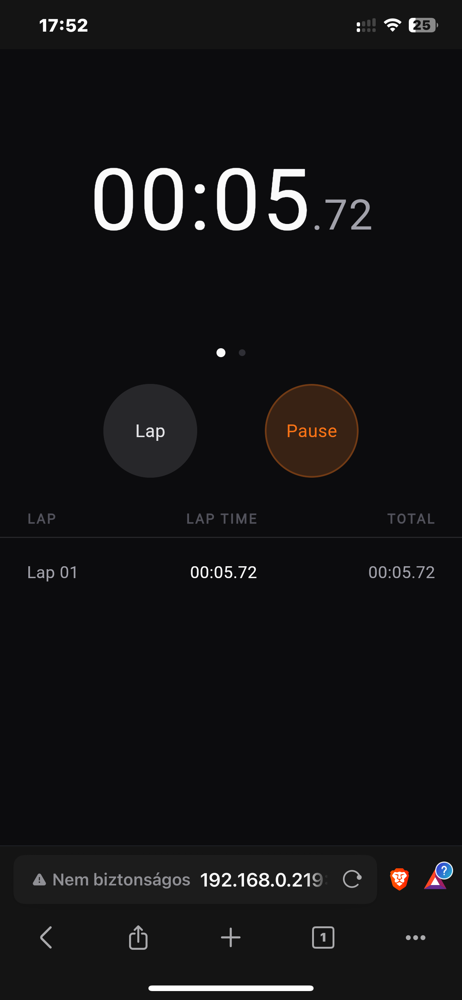
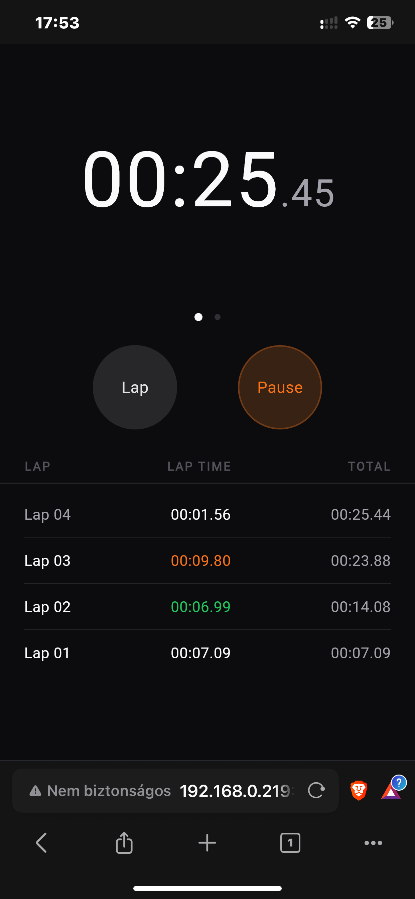
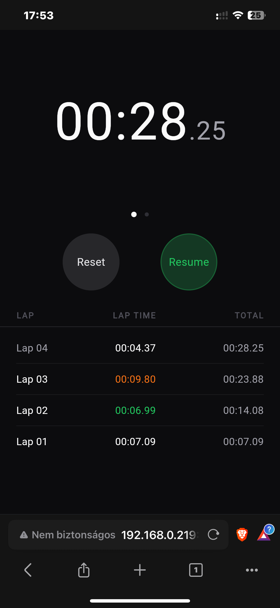
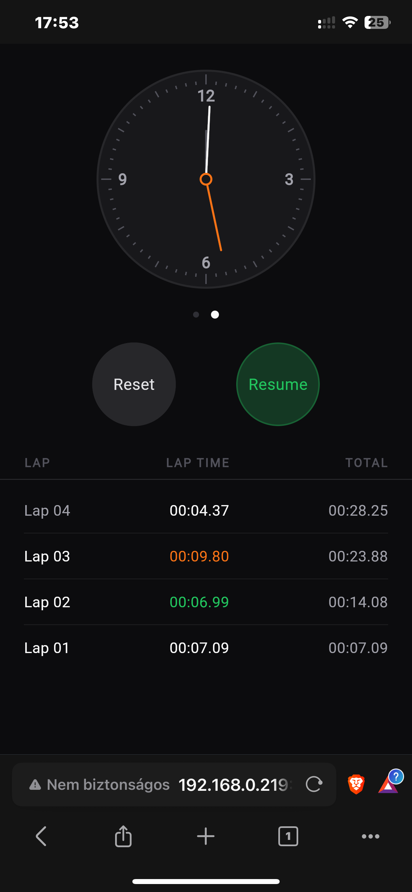
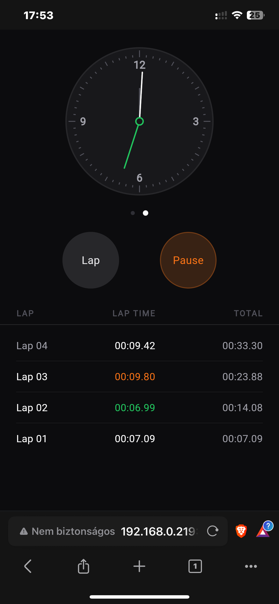
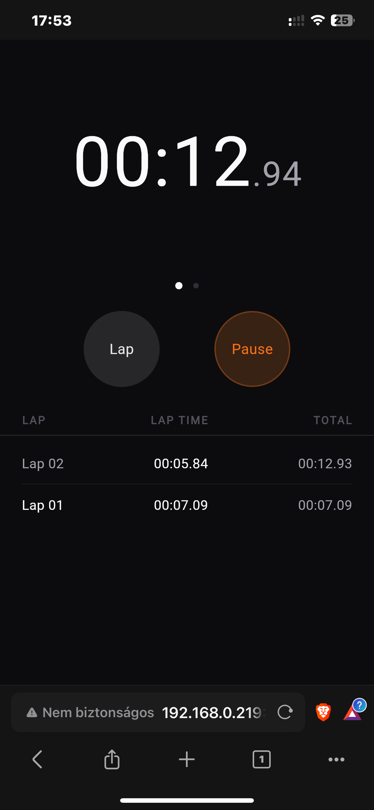
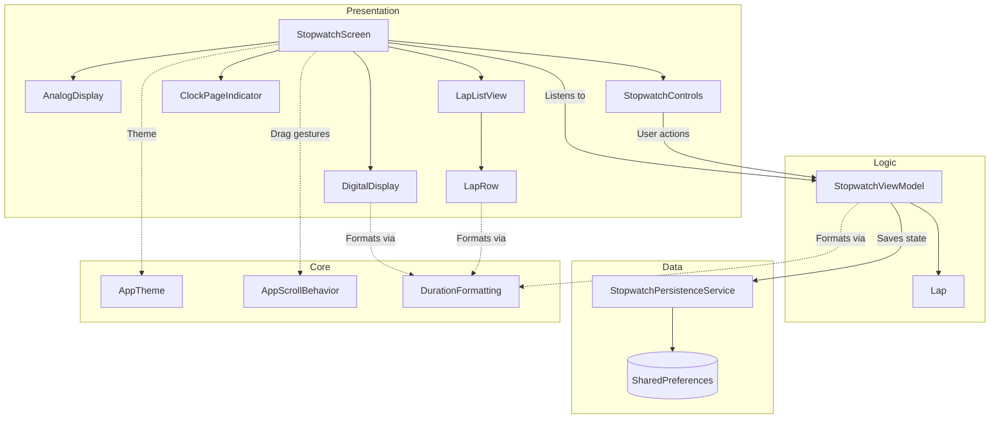

# Stopwatch

A stopwatch application built with Flutter, featuring digital and analog clock displays, lap tracking with split comparisons, and state persistence.

## Screenshots

| Digital Display | Lap Tracking | Paused State |
| :---: | :---: | :---: |
|  |  |  |

| Analog Dial (Paused) | Analog Dial (Running) | Live Lap Split |
| :---: | :---: | :---: |
|  |  |  |

## Features

- **Timekeeping**: Monotonic timing based on Dart's `Stopwatch` class with 30 ms UI tick rate and tabular figure typography.
- **Dual Display**: Switch between digital (`MM:SS.ss`) and analog dial via swipe or page indicator.
- **Lap Tracking**: Records lap splits and cumulative elapsed time. When two or more laps are recorded, the fastest and slowest laps are highlighted.
- **State Persistence**: Saves current elapsed time and recorded laps to local storage (`SharedPreferences`) on app exit or backgrounding, restoring them in a paused state on restart.

## Architecture

The application follows an MVVM architecture with unidirectional data flow:



## Project Structure

```text
lib/
├── core/
│   ├── extensions/
│   │   └── duration_extensions.dart
│   └── theme/
│       ├── app_scroll_behavior.dart
│       └── app_theme.dart
├── data/
│   └── services/
│       └── stopwatch_persistence_service.dart
├── main.dart
└── ui/
    └── features/
        └── stopwatch/
            ├── models/
            │   └── lap.dart
            ├── view_models/
            │   └── stopwatch_view_model.dart
            └── views/
                ├── stopwatch_screen.dart
                └── widgets/
                    ├── analog_display.dart
                    ├── clock_page_indicator.dart
                    ├── digital_display.dart
                    ├── lap_list_view.dart
                    ├── lap_row.dart
                    └── stopwatch_controls.dart
```

## Testing

Run unit and widget tests:

```bash
flutter test
```

Run static analysis:

```bash
dart analyze
```

## Getting Started

### Prerequisites

- Flutter SDK (3.x or higher)

### Run Application

```bash
# Desktop (Linux / macOS / Windows)
flutter run -d linux

# Web
flutter run -d chrome

# Web server (accessible across local network)
flutter run -d web-server --web-port=8080 --web-hostname=0.0.0.0
```
