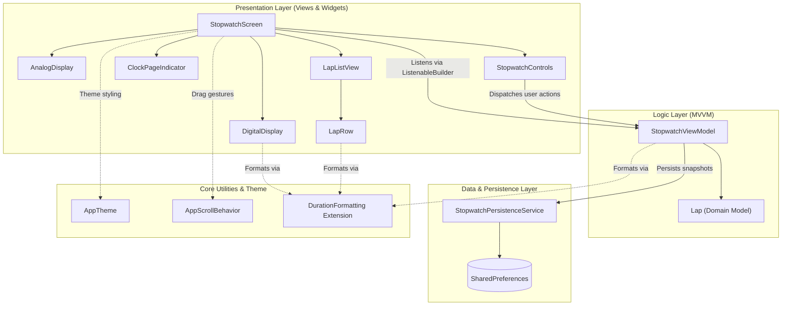

# Minimalist Flutter Stopwatch

A high-performance, minimalist stopwatch application built with **Flutter** and **Dart**, featuring precision timekeeping, split lap tracking with dynamic highlighting, an analog clock display with smooth hand synchronization, and local state persistence.

---

## 📱 Screenshots

| Digital Clock (Running) | Multi-Lap Recording | Paused & Resume Controls |
| :---: | :---: | :---: |
|  |  |  |

| Analog Clock (Paused) | Analog Clock (Running) | Live Lap Split |
| :---: | :---: | :---: |
|  |  |  |

---

## 🚀 Features & Implemented Functionality

### 1. Precision Timekeeping & Core Controls
- **Monotonic Clock**: Built on `dart:core` `Stopwatch` and `DateTime` tracking to ensure monotonic accuracy immune to system clock shifts.
- **Dynamic Controls**:
  - **Initial**: `Start` (enabled, green accent) and `Lap` (disabled).
  - **Running**: Transforms to `Pause` (orange accent) and `Lap` (active).
  - **Paused**: Transforms to `Resume` (green accent) and `Reset` (gray/surface).
- **Tabular Figures Typography**: Uses OpenType `FontFeature.tabularFigures()` on all clock digits, ensuring equal character width and eliminating digit jitter during 30+ FPS ticking.

### 2. Dual Clock Display (Digital & Analog)
- **Digital Display**: Minimalist `MM:SS.ss` format with prominent minute/second numerals and secondary hundredths text.
- **Analog Clock**: Visual dial with synchronized hour, minute, and second hands that move in real-time with the elapsed stopwatch time. Hand accent colors dynamically adjust between running (green) and paused (orange).
- **Interactive Navigation**: Horizontal `PageView` switchable via touch swipe, desktop mouse drag, trackpad, or by tapping the interactive page indicator dots.

### 3. Real-Time Lap Tracking & Highlighting
- **Split Duration & Cumulative Total**: Records the exact split duration between laps as well as the total elapsed stopwatch time.
- **Live Active Lap**: The current running lap dynamically increments in real-time at the top of the lap list.
- **Visual Performance Highlights**: Once 2 or more laps are recorded, the app automatically identifies and highlights:
  - 🟢 **Fastest Lap** in green accent.
  - 🔴 **Slowest Lap** in orange/red accent.
- **Pre-computed Formatting**: Lap durations are formatted on creation and cached in immutable `Lap` models, preventing per-frame string allocations during scrolling.

### 4. State Persistence (Freeze & Restore)
- **Automatic Snapshot**: An `AppLifecycleListener` catches application close, backgrounding, minifying, and OS exit signals.
- **Zero Loss**: When closed while running, the stopwatch freezes the exact elapsed duration and commits the full lap list to disk via `SharedPreferences`.
- **Paused Restoration**: Upon relaunch, the app restores cleanly in a paused state showing the frozen time and complete lap history.
- **Clean Reset**: Tapping "Reset" wipes the stored snapshot and returns to `00:00.00`.

---

## 🏗️ Architecture & Component Diagram

The project follows a layered **Model-View-ViewModel (MVVM)** architecture with clean separation of concerns and unidirectional data flow:



### Component Roles
- **`StopwatchScreen`**: Top-level scaffold hosting the `PageView`, interactive `ClockPageIndicator`, controls, and lifecycle hooks.
- **`StopwatchViewModel`**: `ChangeNotifier` managing the monotonic clock, periodic ticker, lap statistics, and persistence dispatch.
- **`ClockPageIndicator`**: Isolated widget handling animated dot indicators and page animation.
- **`LapRow`**: Focused widget rendering individual lap split items with tabular typography and performance highlights.
- **`DurationFormatting`**: Centralized extension on `Duration` serving as the Single Source of Truth for all time formatting.
- **`StopwatchPersistenceService`**: Handles JSON serialization and asynchronous I/O with `SharedPreferences`.

---

## 📂 Project Structure

```text
lib/
├── core/
│   ├── extensions/
│   │   └── duration_extensions.dart   # Shared duration formatting extension
│   └── theme/
│       ├── app_scroll_behavior.dart   # Touch, mouse & trackpad drag gestures
│       └── app_theme.dart             # Minimalist dark theme palette & typography
├── data/
│   └── services/
│       └── stopwatch_persistence_service.dart  # SharedPreferences snapshot storage
├── main.dart                          # Application entrypoint & MaterialApp setup
└── ui/
    └── features/
        └── stopwatch/
            ├── models/
            │   └── lap.dart           # Immutable Lap model with JSON serialization
            ├── view_models/
            │   └── stopwatch_view_model.dart  # Reactive stopwatch state & lap logic
            └── views/
                ├── stopwatch_screen.dart      # Main screen & lifecycle listener
                └── widgets/
                    ├── analog_display.dart        # Synchronized analog clock dial
                    ├── clock_page_indicator.dart  # Interactive dot indicators
                    ├── digital_display.dart       # MM:SS.ss digital typography
                    ├── lap_list_view.dart         # Scrollable lap history list
                    ├── lap_row.dart               # Individual lap row item
                    └── stopwatch_controls.dart    # Start, Pause, Resume, Reset, Lap
```

---

## 🧪 Testing & Verification

The project includes unit and widget tests:

```bash
# Run all unit and widget tests
flutter test

# Run static analysis
dart analyze
```

### Test Coverage Highlights
- **ViewModel Tests**: Initial idle state, start/pause/resume/reset state transitions, lap calculation with split durations, fastest/slowest lap detection, formatted getters, and persistence save/restore/clear.
- **Widget Tests**: Initial `00:00.00` rendering, button interaction flows, `PageView` swiping and dot tapping between digital and analog displays, analog second hand synchronization on reset, and cold launch state restoration.
- **Extension Tests**: Zero duration, sub-second centiseconds, multi-minute, and multi-hour string formatting.

---

## 🛠️ Getting Started

### Prerequisites
- [Flutter SDK](https://flutter.dev/docs/get-started/install) (3.x or higher)
- [Dart SDK](https://dart.dev/get-dart) (3.x or higher)

### Installation & Run

1. **Clone the repository**:
   ```bash
   git clone <repository_url>
   cd stopwatch_app
   ```

2. **Install dependencies**:
   ```bash
   flutter pub get
   ```

3. **Run on Desktop (Linux / macOS / Windows)**:
   ```bash
   flutter run -d linux
   ```

4. **Run on Mobile / Web Server**:
   ```bash
   # Launch web development server accessible across local Wi-Fi
   flutter run -d web-server --web-port=8080 --web-hostname=0.0.0.0
   ```
   Open `http://localhost:8080` on your PC, or `http://<your-local-ip>:8080` in your mobile browser.
